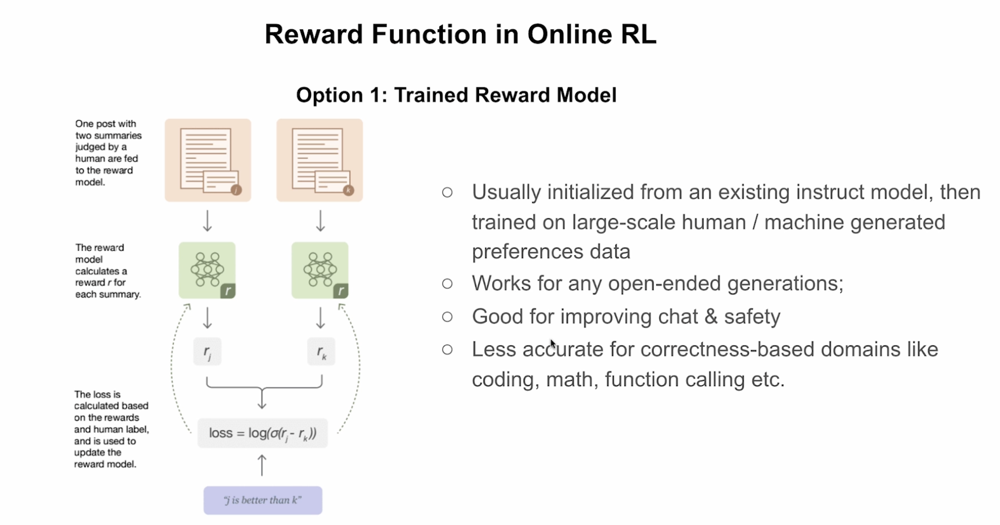

# Bradley-Terry Model for Reward Model Training

This document provides background on the **Bradley-Terry pairwise ranking loss**, which is foundational to training reward models in Reinforcement Learning from Human Feedback (RLHF).

---

## Overview

In Online RL for LLMs, a **trained reward model** is used to score model outputs. The reward model is:

- Initialized from an existing instruct model
- Trained on large-scale human/machine-generated preference data
- Good for open-ended generations (chat, safety)
- Less accurate for correctness-based domains (coding, math, function calling)

*Figure: Trained Reward Model architecture showing pairwise comparison and loss computation.*

---

## The Bradley-Terry Model

The [Bradley-Terry model](https://en.wikipedia.org/wiki/Bradley%E2%80%93Terry_model) is a probability model for the outcome of **pairwise comparisons** between items. Given two items $i$ and $j$, it estimates the probability that $i$ is preferred over $j$:

$$
P(i > j) = \frac{p_i}{p_i + p_j}
$$

where $p_i$ is a positive real-valued score assigned to item $i$.

### Exponential Parameterization

Bradley and Terry defined exponential score functions $p_i = e^{\beta_i}$, leading to:

$$
P(i > j) = \frac{e^{\beta_i}}{e^{\beta_i} + e^{\beta_j}} = \frac{1}{1 + e^{\beta_j - \beta_i}} = \sigma(\beta_i - \beta_j)
$$

where $\sigma$ is the **sigmoid function**: $\sigma(x) = \frac{1}{1 + e^{-x}}$

### Connection to Logistic Regression

The logit form reveals the connection to logistic regression:

$$
\text{logit } P(i > j) = \log \frac{P(i > j)}{P(j > i)} = \beta_i - \beta_j
$$

### Historical Note

- Named after Ralph A. Bradley and Milton E. Terry (1952)
- Earlier studied by Ernst Zermelo in the 1920s
- Applications: sports rankings, consumer choice, **AI model ranking**, search engine relevance

---

## Application to Reward Model Training

### Setup

Given a prompt with two candidate responses:

- **j** = preferred/chosen response (human-labeled)
- **k** = rejected/worse response

The reward model $r_\theta$ outputs scalar scores $r_j$ and $r_k$ for each response.

### The Loss Function

The reward model is trained using the **negative log-likelihood** of the Bradley-Terry model:

$$
\mathcal{L}(\theta) = -\log \sigma(r_j - r_k)
$$

where:

- $r_j = r_\theta(\text{prompt}, \text{response}_j)$ — reward for chosen response
- $r_k = r_\theta(\text{prompt}, \text{response}_k)$ — reward for rejected response
- $\sigma(x) = \frac{1}{1 + e^{-x}}$ — sigmoid function

### Intuition

| Scenario | $r_j - r_k$ | $\sigma(r_j - r_k)$ | $-\log \sigma(...)$ |
|----------|-------------|---------------------|---------------------|
| Model correctly ranks $j \gg k$ | Large positive | ≈ 1 | ≈ 0 (low loss) |
| Model uncertain | ≈ 0 | ≈ 0.5 | ≈ 0.69 |
| Model incorrectly ranks $k > j$ | Negative | ≈ 0 | Large (high loss) |

**Key insight:** $\sigma(r_j - r_k)$ represents the model's predicted probability that $j$ is better than $k$. Since $j$ is truly better (ground truth), we want to maximize this probability.

### Gradient Analysis

Taking derivatives with respect to the reward model parameters:

$$
\frac{\partial \mathcal{L}}{\partial r_j} = -(1 - \sigma(r_j - r_k)) \quad \text{(pushes } r_j \text{ higher)}
$$

$$
\frac{\partial \mathcal{L}}{\partial r_k} = +(1 - \sigma(r_j - r_k)) \quad \text{(pushes } r_k \text{ lower)}
$$

The gradients naturally:

1. **Increase** the reward for preferred outputs
2. **Decrease** the reward for rejected outputs
3. Scale by $(1 - \sigma(r_j - r_k))$: larger updates when model is uncertain or wrong

---

## Connection to DPO

Direct Preference Optimization (DPO) builds on this same Bradley-Terry framework but eliminates the need for an explicit reward model by directly optimizing the policy. The DPO loss is:

$$
\mathcal{L}_{\text{DPO}}(\pi_\theta; \pi_{\text{ref}}) = -\log \sigma\left(\beta \log \frac{\pi_\theta(y_w|x)}{\pi_{\text{ref}}(y_w|x)} - \beta \log \frac{\pi_\theta(y_l|x)}{\pi_{\text{ref}}(y_l|x)}\right)
$$

where the implicit reward is $r(x, y) = \beta \log \frac{\pi_\theta(y|x)}{\pi_{\text{ref}}(y|x)}$.

---

## Summary

| Aspect | Description |
|--------|-------------|
| **Model** | Bradley-Terry pairwise comparison |
| **Loss** | $-\log \sigma(r_{\text{chosen}} - r_{\text{rejected}})$ |
| **Goal** | Learn rewards that rank preferred responses higher |
| **Gradient effect** | Increase chosen reward, decrease rejected reward |
| **Used in** | RLHF reward model training, DPO, preference learning |

---

## References

1. [Bradley-Terry Model - Wikipedia](https://en.wikipedia.org/wiki/Bradley%E2%80%93Terry_model)
2. Christiano et al. (2017). "Deep Reinforcement Learning from Human Preferences"
3. Ouyang et al. (2022). "Training language models to follow instructions with human feedback" (InstructGPT)
4. Rafailov et al. (2023). "Direct Preference Optimization: Your Language Model is Secretly a Reward Model"
