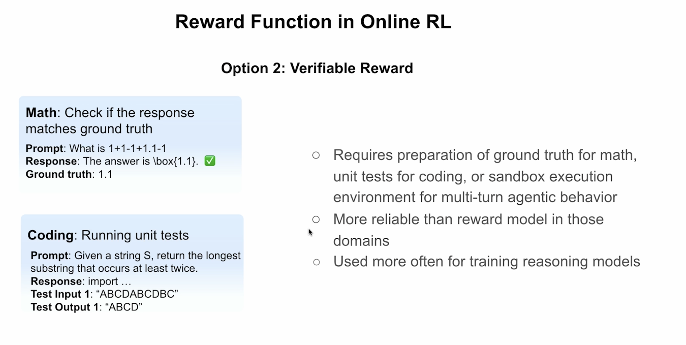

# Verifiable Rewards for LLM Training (RLVR)

This document explains **Reinforcement Learning with Verifiable Rewards (RLVR)**, an increasingly popular alternative to traditional RLHF for training reasoning models.

---

## Overview

**Verifiable Reward** (Option 2 in Online RL) uses deterministic, rule-based verification instead of a learned reward model:

- Requires preparation of **ground truth** for math, **unit tests** for coding, or **sandbox execution** for agentic behavior
- **More reliable** than learned reward models in verifiable domains
- **Used more often** for training reasoning models (as of late 2024/2025)



*Figure: Verifiable Reward examples for math (ground truth matching) and coding (unit test execution).*

---

## Why Verifiable Rewards?

### Problems with Learned Reward Models

Traditional RLHF uses a neural network reward model trained on human preferences (Bradley-Terry loss). However:

1. **Reward hacking** — Models exploit weaknesses in learned reward models
2. **Expensive** — Requires training and running a full LLM-sized reward model
3. **Noisy** — Human preferences can be inconsistent
4. **Limited scalability** — Hard to scale human annotation

### Benefits of Verifiable Rewards

| Aspect | Learned Reward Model | Verifiable Reward |
|--------|---------------------|-------------------|
| **Cost** | Expensive (full LLM) | Cheap (rule-based) |
| **Reliability** | Can be hacked | Deterministic |
| **Scalability** | Limited by annotation | Unlimited |
| **Domains** | Open-ended tasks | Math, code, structured tasks |

---

## How Verifiable Rewards Work

### Math Problems

```text
Prompt: What is 1+1-1+1.1-1
Response: The answer is \boxed{1.1}. ✓
Ground truth: 1.1

Reward = 1.0 if extracted_answer == ground_truth else 0.0
```

**Implementation pattern:**

```python
import re

def math_reward_func(completions, ground_truth, **kwargs):
    # Extract answer from \boxed{...} format
    matches = [
        re.search(r"\\boxed\{(.*?)\}", completion[0]['content']) 
        for completion in completions
    ]
    contents = [match.group(1) if match else "" for match in matches]
    
    # Binary reward: 1 if correct, 0 otherwise
    return [1.0 if c == gt else 0.0 for c, gt in zip(contents, ground_truth)]
```

### Coding Problems

```text
Prompt: Given a string S, return the longest substring that occurs at least twice.
Response: import ...
Test Input 1: "ABCDABCDBC"
Test Output 1: "ABCD"

Reward = 1.0 if all_tests_pass else 0.0
```

**Implementation pattern:**

```python
def code_reward_func(completions, test_cases, **kwargs):
    rewards = []
    for completion, tests in zip(completions, test_cases):
        code = extract_code(completion)
        try:
            # Execute in sandbox
            passed = run_tests_in_sandbox(code, tests)
            rewards.append(1.0 if passed else 0.0)
        except Exception:
            rewards.append(0.0)  # Compilation/runtime error
    return rewards
```

### Format Rewards (Optional)

In addition to accuracy, format rewards enforce structured output:

```python
def format_reward_func(completions, **kwargs):
    rewards = []
    for completion in completions:
        content = completion[0]['content']
        # Check for thinking tags
        has_think = '<think>' in content and '</think>' in content
        rewards.append(1.0 if has_think else 0.0)
    return rewards
```

---

## RLVR in Practice: DeepSeek-R1

DeepSeek-R1 (January 2025) demonstrated that **pure RL with verifiable rewards** can induce reasoning capabilities without supervised fine-tuning.

### Key Findings

> "We do not apply the outcome or process neural reward model in developing DeepSeek-R1-Zero, because we find that the neural reward model may suffer from reward hacking in the large-scale reinforcement learning process."
> — DeepSeek-R1 Paper

### DeepSeek's Reward System

1. **Accuracy rewards** — Rule-based verification of correctness
   - Math: Check final answer in `\boxed{}` format
   - Code: Compiler feedback on predefined test cases

2. **Format rewards** — Enforce thinking structure
   - Require `<think>...</think>` tags for reasoning

### Training Pipeline

```text
DeepSeek-R1-Zero: Base Model → RLVR (GRPO) → Reasoning Model
DeepSeek-R1:      Base Model → SFT → RLVR → RLHF → Final Model
```

The elimination of the reward model and value model (critic) makes RLVR with GRPO significantly more efficient than traditional PPO-based RLHF.

---

## Is RLVR Used More Often Today?

**Yes, for reasoning models.** As of late 2024/early 2025:

### Evidence of Adoption

| Model/Paper | Date | Approach |
|-------------|------|----------|
| DeepSeek-R1 | Jan 2025 | RLVR with GRPO |
| OpenAI o1/o3 | 2024-2025 | Likely uses verifiable rewards for math/code |
| Qwen-Math | 2024 | Verifiable rewards for math reasoning |
| Various open-source | 2025 | Following DeepSeek-R1 approach |

### Why the Shift?

1. **Reasoning models need correctness** — Subjective preferences don't help with math/code
2. **Scalability** — Can generate unlimited training signal
3. **Reliability** — No reward hacking on deterministic checks
4. **Efficiency** — No need to train/run expensive reward models

### Limitations

RLVR works best for **verifiable domains**:

- ✅ Mathematics (exact answers)
- ✅ Coding (test cases)
- ✅ Formal logic
- ⚠️ Open-ended generation (still needs RLHF)
- ⚠️ Subjective tasks (chat, creative writing)

Recent work (March 2025) explores extending RLVR to broader domains like medicine, chemistry, and education using expert-written reference answers with soft scoring.

---

## Comparison: RLHF vs RLVR

| Aspect | RLHF | RLVR |
|--------|------|------|
| **Reward source** | Learned from preferences | Rule-based verification |
| **Models needed** | Policy + Reward + (Critic) | Policy only |
| **Best for** | Chat, safety, open-ended | Math, code, reasoning |
| **Scalability** | Limited by human labels | Unlimited |
| **Risk** | Reward hacking | Limited domain coverage |
| **Cost** | High | Low |

---

## Example: GRPO with Verifiable Rewards

From Lesson 7 notebook, using TRL's `GRPOTrainer`:

```python
from trl import GRPOTrainer, GRPOConfig

def reward_func(completions, ground_truth, **kwargs):
    """Verifiable reward for math problems."""
    matches = [
        re.search(r"\\boxed\{(.*?)\}", c[0]['content']) 
        for c in completions
    ]
    contents = [m.group(1) if m else "" for m in matches]
    return [1.0 if c == gt else 0.0 for c, gt in zip(contents, ground_truth)]

config = GRPOConfig(
    per_device_train_batch_size=1,
    gradient_accumulation_steps=8,
    num_generations=4,  # Sample multiple responses per prompt
    num_train_epochs=1,
    learning_rate=5e-6,
)

trainer = GRPOTrainer(
    model=model,
    args=config,
    reward_funcs=reward_func,  # Verifiable reward function
    train_dataset=train_dataset
)

trainer.train()
```

---

## Summary

| Aspect | Description |
|--------|-------------|
| **What** | Rule-based rewards instead of learned reward models |
| **Why** | More reliable, cheaper, scalable for verifiable tasks |
| **How** | Ground truth matching, test execution, format checking |
| **When to use** | Math, coding, formal reasoning tasks |
| **Trend** | Increasingly dominant for reasoning model training (2024-2025) |

---

## References

1. DeepSeek-AI. (2025). "DeepSeek-R1: Incentivizing Reasoning Capability in LLMs via Reinforcement Learning" [arXiv:2501.12948](https://arxiv.org/abs/2501.12948)
2. DeepSeek-AI. (2024). "DeepSeekMath: Pushing the Limits of Mathematical Reasoning in Open Language Models" [arXiv:2402.03300](https://arxiv.org/abs/2402.03300)
3. Raschka, S. (2025). "The State of Reinforcement Learning for LLM Reasoning" [Blog](https://sebastianraschka.com/blog/2025/the-state-of-reinforcement-learning-for-llm-reasoning.html)
4. "Crossing the Reward Bridge: Expanding RL with Verifiable Rewards Across Diverse Domains" (March 2025) [arXiv:2503.23829](https://arxiv.org/abs/2503.23829)
